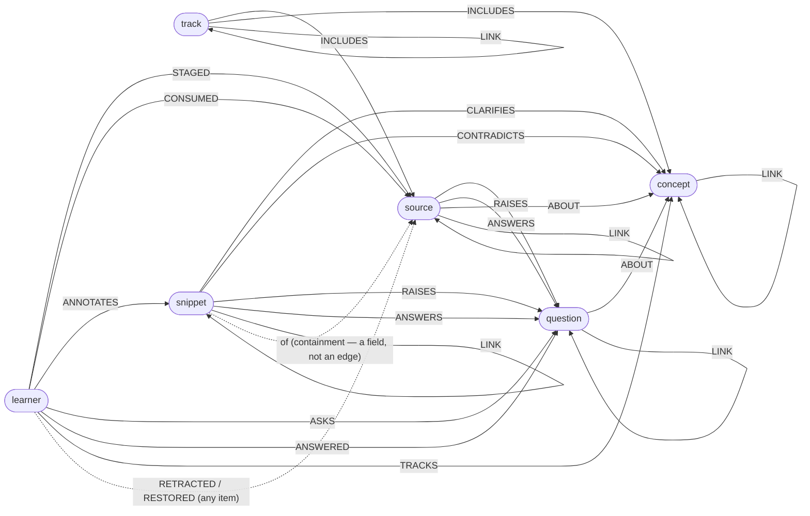

# Philomatic Data Model — living reference

> **Division of record.** This document describes the **current, as-built data model** — its
> entities, identity rules, edge taxonomy, and semantics — in one coherent pass. Authority is
> split three ways, on purpose:
> - **Shape truth: the code.** `src/schema/` (Zod) and `src/parser/` are the machine-checked
>   definition. If this document disagrees with them about a field or rule, the code is right
>   and this document has a bug.
> - **Meaning truth: this document.** What an edge *means*, why an id is derived the way it is,
>   which fields are semantic vs. metadata — prose the code cannot carry coherently.
> - **History: `MVP.md`.** The frozen record of how the model got here, in
>   build order. Its early sections are intentionally superseded by later slices; do not read it
>   for current state.
>
> **Change protocol.** The model is expected to take *slight* adjustments from alpha feedback —
> it is stable, not sacred. Any change here is, by definition, a **lock-line kind-3 change**
> (ARCHITECTURE.md principle #7): deliberate, rare, and made once. The rule: **a PR that edits
> `src/schema/` must update this document in the same PR.** Changes must preserve the ROADMAP §4
> invariants — above all: content-derived ids, append-only observations, explicit membership.

---

## 1. The shape of the graph

A **property graph on SQLite**: one table per entity kind, one **universal edge table**, and an
**append-only event log**. Everything the model asserts is one of:

| Kind | What it is | Mutability |
|---|---|---|
| **Entity** | a node with a deterministic id and fields | idempotent-merge upsert (last-write-wins — the known clobber caveat, ROADMAP §1.1) |
| **Edge** | a typed relationship; identity = `(srcId, dstId, type, trackContextId)` | idempotent-merge upsert; **edge tags merge by SET-UNION** (model v2 — re-asserts accumulate classifications, never clobber; removal is an explicit set-replace) |
| **Event** | a timestamped behavioral fact; identity = `(learnerId, verb, targetId, occurredAt)` | **append-only, immutable** |
| **Typed tag** | `{name, subtype?, degree?}` attached to any entity or edge | rides its owner |

**Removal never mutates any of these.** `remove` is an appended `RETRACTED` event that views
fold away (§6); physical DELETE exists nowhere in `src/storage`.

The portable unit is the **canonical payload** (`CanonicalPayloadSchema`, `version: 2` since
model v2): learners, tracks, concepts, sources, snippets, questions, events, edges. It is a
*value* — export → import on another instance reproduces the identical graph, **retraction
history included**. `version: 1` payloads are never rejected: ONE pure shim (`src/io/migrate.ts`)
rewrites them at import (id re-key for formerly author-bearing sources + the edge collapse of
§4), and pre-v2 store *files* are rebuilt the same way at server boot (`migrateDbV2`, backup
kept). Store-local metadata (`created_at`/`updated_at` columns) is deliberately **outside** the
payload and outside this model: like file mtimes, it never affects identity, projections, or
portability.

## 2. Identity — content-derived, deterministic, load-bearing

Ids are pure functions of content (`src/schema/ids.ts`), which is what makes import idempotent
and the payload portable — the property Phase-2 sync relies on. **Do not casually change these**
(ROADMAP §1.2):

| Entity | Derivation |
|---|---|
| Concept | `cpt_` + slug(name) |
| Track | `syl_` + slug(title) — historical prefix (tracks were once named syllabi); opaque, frozen |
| Source | `src_` + sha256(`canonicalUrl\|`)[:24] when a URL exists (`directUrl`, else `bibliographicUrl`); else `src_` + slug(title). **Model v2: `author` left the hash** (a pure attribute now — adapter author-resolution can't change identity). The trailing `\|` is v1's author separator pinned to `''`, kept so never-authored ids survived v2 unchanged; formerly authored ids were re-keyed by the migration shim |
| Snippet | `snp_` + sha256(`sourceId\|normalized text`)[:24] |
| Question | `qst_` + sha256(`normalized text`)[:24] |
| Learner | opaque (`lnr_default` is the seeded single tenant). **Never bake a learner id into an id derivation or cross-reference** — the multi-tenant re-key (`rekey-learner`, a pure map over learners/overlay edges/events/creatorId) must stay pure (scaling audit A3) |

The sha256-based ids are **truncated to the first 24 hex chars** (e.g. `src_5583f79c309236c3c90e07a3`) — enough to avoid collision at personal scale; the slug-based ids (concept/track, and URL-less sources) are the readable slug in full. "Normalized text" = trimmed, whitespace-collapsed, lowercased.

**Canonical URL normalization**: lowercase scheme/host, strip `www.`, drop fragment, remove
tracking params (`utm_*`, `fbclid`, `gclid`, `ref`), sort remaining params, trim trailing slash.
Exact-normalized-URL match is the *only* dedup in Phase 1; the fuzzy ladder is deferred
(ROADMAP §1.3).

**Known identity caveats**: text-derived ids collapse only on exact normalized match;
near-duplicates fork until Phase-2 dedup. (The former caveat — `author` inside `sourceId`
blocking adapter-resolved authors — was **resolved by model v2**: author is an attribute, in
`ResolvePatch`, carried forward on re-capture like every resolver-writable field.)

**Rename-by-supersession (track, 2026-07)**: a track title change through `update` does
NOT mutate the id — the engine mints the track under its new slug id (all other fields
carried), re-asserts every edge referencing the old id (endpoints *and* `trackContextId`),
and retracts the old entity (restorable). `update` returns the **new** `targetId`. Identity
stays content-derived throughout; a rename onto an existing live title is rejected (merge is
Phase-2 dedup). Question / snippet / concept renames remain blocked — their hash ids anchor
edges the same way, but they have no equivalent cheap edge set to re-assert, so they wait for
the identity-resolution layer.

## 3. Entities (as built)

- **Learner** — `{id, displayName, profile?}`. The tenant whose behavior overlays the shared
  graph; in the core because behavior is the raw signal. `profile` is an opaque blob until
  multi-tenant structures it (ROADMAP §2.1).
- **Concept** — `{id, name, description?, aliases[], tags[]}`. The atomic knowledge unit.
  `aliases` are alternative names to assist search/LLM mapping ("Backprop").
- **Source** — `{id, title, author?, directUrl?, bibliographicUrl?, personalUrl?, modality,
  estimatedDurationMins?, status, tags[]}`. The URL trio: `directUrl` = consume-online link (the
  identity URL); `bibliographicUrl` = DOI/WorldCat/publisher-class reference; `personalUrl` = the
  user's own local/cloud copy (`file:///` allowed). `modality` ∈ text/video/audio/interactive/
  other (host-inferred at capture, overridable). `status` ∈ active/archived/dead_link (dead_link
  feeds the Phase-2 link-rot story).
- **Snippet** — `{id, sourceId, text, anchor?, tags[]}`. A highlighted passage — the *shared*
  part of an annotation. The learner's note/sentiment is **not** a field: it rides the
  `ANNOTATES` edge metadata, keeping the passage shareable and the reaction personal. `anchor`
  is an opaque, extension-defined locator (the engine only stores it).

  **The fields-vs-edges rule** (containment; the razor's structural counterpart): a **mandatory
  existence-dependency is a field and an id component, never an edge row** — `snippet.sourceId`
  participates in the snippet's identity, so "a snippet with zero or two sources" is
  unrepresentable, and the retraction ownership cascade (§6) rides the field. Edges are for
  *optional, plural* relations. The taxonomy diagram (§4.1) draws containment dashed so bare
  snippets never look orphaned.
- **Question** — `{id, text, description?, tags[]}`. First-class inquiry node parallel to
  Concept. Its meaning is its answer set (`ANSWERS` links); an asked question with no `ANSWERS`
  is a computable **information gap**.
- **Track** — `{id, creatorId, title, goal?, framework?, locked, validationState, tags[]}`.
  A scoped, ordered view over members. Membership is **only** via explicit `INCLUDES` edges —
  the membership invariant (ROADMAP §4.1). `framework` names an opted-in rigid framework
  (Phase 2); `locked` selects static vs. dynamic upkeep (spec §5.B).

**Sentiment is a free string** (in `ANNOTATES` metadata / `#sentiment:*` tags), not an enum —
the engine stays agnostic to UX vocabulary (ARCHITECTURE.md principle #7).

## 4. Edge taxonomy (model v2)

**The razor** (v2's governing rule, 2026-07): **an edge is a
first-class type iff the engine itself consumes or enforces its semantics** — membership,
ordering, acyclicity, gap computation, aboutness, **negation**, and the behavioral overlay.
Everything purely *descriptive* is a generic `LINK` (or `ABOUT`) whose meaning rides
**framework-declared tags** (§5; the framework files live in `src/framework/`).
Every future "edge or tag?" argument resolves against this rule.

Endpoint typing is enforced by the parser from `src/schema/edges.ts`. Edges may carry `metadata`
(JSON) and tags (union-merged, §1). **Context-scoped** edges carry `trackContextId` so the
same pair can relate differently per track.

| Edge | Endpoints | Why it is a type (the razor) / meaning |
|---|---|---|
| `PREREQUISITE_OF` | concept→concept | Rigid dependency; **global + acyclic** (cycle-checked); `assemble()` orders by it |
| `CLARIFIES` / `CONTRADICTS` | snippet→concept | **The polarity pair — negation is an engine primitive**, never optional framework vocabulary: consensus folds, quality signals, and hooks must see disagreement with no framework installed |
| `RAISES` / `ANSWERS` | source\|snippet→question | Gap computation (`gap`, `answeredBy`) |
| `ABOUT` | question\|source→concept | Ontology anchoring. *Content is about a concept; tags say how*: the source→concept pair carries `#Explains` / `#Demonstrates` / `#Exercises` (formerly three edge types). **A candidate pool — never auto-pulled into membership** |
| `INCLUDES` | track→source\|concept | **The only membership relation**; member *roles* ride tags (`#Seminal`, `#Foundational`) — a role can no longer exist without the membership |
| `PREREQUISITE_OF_SYL` | track→track | Macro-sequencing |
| `PRECEDES` | source→source | Soft reading order; **track-scoped + acyclic per track** |
| `LINK` | same-kind pairs (concept, source, track, question, snippet) | The generic descriptive link — meaning rides framework tags (core's `#Refines`, `#Complements`, `#AnalogousTo`, `#IsEvidenceFor`, `#RefersTo`, `#Expands`, `#DerivativeOf`; snippet↔snippet carries argument diagramming's `#Supports`/`#Opposes`, propositional logic's `#Implies`/`#EquivalentTo`/`#Negates`, and hermeneutics' `#Interprets`/`#ParallelPassage`/`#Alludes`/`#TypeOf`/`#Tension`; source↔source adds hermeneutics' `#CommentaryOn`/`#TranslationOf` — `GET /framework` is the authority); **a bare untagged LINK is legal**: "related, unclassified" |
| `STAGED` / `CONSUMED` | learner→source | Overlay: backlogged / consumed |
| `ANNOTATES` | learner→snippet | Overlay: note + sentiment in edge metadata |
| `ASKS` / `ANSWERED` | learner→question | Overlay: open curiosity / demonstrated competence — **this is progress** (no self-claimed mastery) |
| `TRACKS` | learner→concept | Overlay: opted-in following — the freshness gate |

**Two ordering relations, on purpose**: `PREREQUISITE_OF` is a rigid, global, semantic
dependency; `PRECEDES` is a soft, per-track curatorial ordering. They never merge.

**Retired in v2** (rewritten by the import shim, §1): `EXPLAINS`/`DEMONSTRATES`/`EXERCISES` →
`ABOUT`+tag; `SEMINAL` → tag on `INCLUDES`; `REFINES`/`COMPLEMENTS`/`ANALOGOUS_TO`/
`IS_EVIDENCE_FOR`/`EXPANDS`/`DERIVATIVE_OF` → `LINK`+tag; `REFERENCE_FOR` → `LINK`+`#RefersTo`
with **endpoints inverted** (v1 read "A is a reference *for* B"). `REFINES`' acyclicity check
retired with the type — refinement-DAG rigidity returns as an opt-in framework *rule* (F1,
validation reports, never import failures; ROADMAP §2.4).

**Edges are binary, forever — arity pressure is entityhood pressure** (decision of record,
2026-07-16). The linked-premises bundle (§5) works because that hyperedge shares one endpoint;
n-ary shapes with a genuinely distinct third role (a Toulmin warrant, statements *about* a
relation, "supports under interpretation I") are handled by **reification, never wider edges**:
the moment a relation must participate in other relations, it becomes an entity with a
content-derived id — the model's standing move (Question is a reified inquiry; the deferred
Claim/Answer nodes; edge reification arrives with assertion ids, ROADMAP §2.1). A ternary edge
type would re-key every edge (identity 4-tuple → 5-tuple), fork the universal edge table, and
complicate every fold and merge — for expressiveness reification already provides.

### 4.1 The taxonomy as a diagram — generated, never drawn

Rendered from `ENDPOINT_RULES` by `pnpm diagram` (src/io/taxonomy.ts); `test/diagram.test.ts`
fails CI if this block drifts from the schema. The same generation bakes the tester-language
glossary into the UI's Model tab (`ui/src/generated/model.ts`).

<!-- edge-taxonomy:begin — generated by `pnpm diagram`; do not edit by hand -->

<!-- edge-taxonomy:end -->

## 5. Typed tags, and the framework layer (F0)

Sugar grammar `#name`, `#name:degree`, `#name:subtype`, `#name:subtype:degree` → canonical
`{name, subtype?, degree?}` (degree is an integer; subtype non-numeric). Free vocabulary by
design — controlled vocabularies (e.g. `#domain:*` hierarchies) are an opt-in **Framework
lens**, never baked into content (ARCHITECTURE.md §6; ROADMAP §1.4/§2.4).

**The tags/metadata boundary (model v2 D5/D6, no exceptions):** *edge tags classify* — they are
multi-valued, **union-merged on upsert**, and their vocabulary is **framework-declared** (a
framework is a *data file*: name, `{type, srcKind, dstKind}` selector, direction/inverseLabel,
description — `philomatic-core`, `argument-diagramming`, `propositional-logic`, and
`hermeneutics` ship built-in, validated at load, served at `GET /framework`, baked into both
UIs by `pnpm diagram`; `defeasible-deontic` stays an unregistered draft until F1 lint exists). *Edge metadata is content* — single-valued personal
state (the `ANNOTATES` note and sentiment; hermeneutics adds a `sense` vocabulary there),
replace-on-update; frameworks may declare metadata
*vocabularies* (rendering only) — in F0 **on learner-overlay edges only** (audit A2: shared-edge
metadata must not grow before the assertion layer makes it addressable). The parser stance is
**accepted-but-unstyled** (D4): unknown edge tags import fine and render plain — rigidity is
opt-in at the UI/validation-report level, never at the import boundary. The engine never
interprets a framework; sentiment stays a free string in the model.

**Front-end portability (the multi-client contract):** meaning lives on the SERVER as data,
never in a client build — any front end (the extension, an Obsidian plugin, a future mobile
client) gets vocabulary from `GET /framework` at runtime (our extension bakes a copy only
because the lock line bars it from importing src/). Semantics needed by *code* are
machine-readable fields on the declarations (`direction`, `inverseLabel`, `subtypeRole:
'bundle'` for the linked-premises convention) — prose descriptions are for humans, and a
convention that exists only as prose is a bug. Bundle keys and every framework tag are ordinary
payload data (no client-side sidecar state to sync). The one multi-client caveat: concurrent
front ends amplify the A2 edge-metadata clobber (§8) — clients must read-modify-write through
`update()` until the assertion layer.

## 6. Time — the event log

Behavioral verbs (`STAGED`, `CONSUMED`, `ANNOTATES`, `ASKS`, `ANSWERED`, `TRACKS`) are
**write-both**: one timeless fact edge (idempotent) + one immutable log event with `occurredAt`
(epoch-ms, supplied or sampled from the injected clock at the boundary — never inside the core).
"Current state" is a pure fold over the log; recency/freshness are derived projections, never
stored. `occurredAt` is *data* (a portable observation), not an ambient clock dependency — the
first genuinely now-dependent read (decay) is deferred (ROADMAP §2.3).

**Removal is retraction.** Two **event-only** editorial verbs,
`RETRACTED` and `RESTORED`, record removal and undo as observations. Desugar derives **no fact
edge** for them — the one deliberate write-both asymmetry, because retraction is inherently
temporal (latest wins) where the behavioral facts are timeless. An entity is *retracted* iff its
most recent `RETRACTED`/`RESTORED` event (by `occurredAt`; same-ms ties → `RESTORED` wins) is
`RETRACTED` — a pure fold (`liveView` in `src/engine/read.ts`). Human-facing projections
(`snapshot()`, `assemble()`, Mermaid) read the live world:

- **Ownership cascade** (computed in the fold, never written): a retracted source hides its
  snippets and every edge touching either; one event suffices, and restoring the source revives
  the whole subtree.
- **Reference cascade**: retracting a shared anchor (a concept) hides only its **edges** —
  annotations survive, falling to unanchored/global space in the views.
- **The `removed` projection** is the complement: retracted entities with their cascade-hidden
  dependents — the slim trash bin behind restore affordances.
- `exportAll()` never applies the fold: the canonical payload is the full value, so retraction
  history is portable and two logs merge by set-union.

Retraction targets content kinds only (`RETRACTABLE_KINDS`: track, concept, source, snippet,
question) — never learners. Edge and event retraction (including un-consume / un-follow of the
behavioral overlay) are deferred until assertions give statements addressable ids (ROADMAP §2.1,
§2.3).

## 7. Observations vs. learnings — the governing rule, and the triangle

The base stores **per-learner observations** (what was done and claimed); every aggregate —
helpfulness, association strength, common questions, domain cohesion, consensus — is a **derived
view**, never base truth. Higher-order expressiveness lives in fold functions over a weak,
monotone, union-mergeable base; that is what keeps sync trivial and merges conflict-free. All
five ROADMAP §4 invariants bind every model change. Retraction-as-observation for `remove` is
now **as built** (§6); the remaining reserved evolution path (per-asserter **assertions** with
deterministic ids) is designed in ROADMAP §§1.1–1.2, 2.1.

**The triangle** (model v2's framing of the same rule): three corners — **learner**, **text**
(the shared content graph), **community**. Subjectivity is *structural*, never a flag: every
subjective claim is an edge **whose src endpoint is the learner** (`ANNOTATES` "this confused
me", `ASKS`, `CONSUMED`, …); text↔text claims (`ABOUT`, `LINK`, `PRECEDES`, …) are shared-corpus
statements — the half Phase-2 assertions will consensus-fold per asserter. **Frameworks are a
community feature**: a lens the community authors to help learners classify the shared half.
Community aggregation folds *published* learner observations; it never reaches into the private
overlay uninvited. (One projection-level echo: a question's `gap` — nothing in the corpus
answers it — is a fact about the *text* and deliberately never learner-scoped, while
`asked`/`answered` scope to the learner; T4.)

## 8. Standing rules from the Phase-2 scaling audit (2026-07)

- **Edge metadata is the first migration target of the assertion layer** (audit A2). It is the
  highest-churn personal data (`ANNOTATES` note/sentiment) on the least-addressable structure
  (last-write-wins on a 4-tuple identity): the first multi-device sync clobbers exactly the data
  users care most about. Until assertions land: **no new feature adds state to edge metadata**
  beyond the §5 boundary, and framework `metadataFields` stay overlay-only.
- **The retraction fold is sync's most clock-skew-sensitive consumer** (audit A4): latest-wins
  by `occurredAt` means skewed devices can resurrect deletions. Phase-2 clock-skew handling
  (ROADMAP §2.1) must be designed against this fold first, not average-case event ordering.
- **The learner re-key must stay a pure map** (audit A3): see §2's learner row.

## 9. Deferred and vestigial

- **Deferred fields** (designed, never populated in Phase 1): `embedding` (source: recommendation
  matching; concept: source→concept mapping), `simHash` (near-dup text identity only),
  `compoundEmbedding` (one vector over snippet text + note + sentiment — the consensus engine's
  unit of annotation meaning). ROADMAP §2.2.
- **Domain machinery: removed** (rode the retraction kind-3 change, 2026-07). `EntityKind` no
  longer lists `'domain'`, and `ENCOMPASSES`/`SUBDOMAIN_OF` are gone from the edge taxonomy — no
  Domain entity ever existed (the reverted Domain-as-entity decision, ARCHITECTURE.md §6).
  Domains are `#domain:*` tag observations + derived views; hierarchy, if a consumer ever needs
  it, is the deferred `BROADER` concept→concept edge (ROADMAP §2.4).

## Historical names (frozen physical artifacts)

The **track** entity was named *syllabus* until 2026-07-18 (pre-release rename). Three
physical names are frozen forever so no store or export ever needs migration:

| Frozen name | Where | Modern meaning |
|---|---|---|
| `syl_` id prefix | every track id | opaque prefix, never parsed for meaning |
| `syllabi` table, `syllabus_context_id` column | SQLite store | the tracks table / `trackContextId` |
| `syllabi:`, `syllabusContextId`, sugared `explains:` | old export/import JSON | accepted forever as import aliases (`tracks`, `trackContextId`, `about`); never emitted |

Wire contracts renamed in the same cleanup: READ_VERSION 2 (`SourceView.explains` →
`about`; snapshot `syllabi` → `tracks`).
